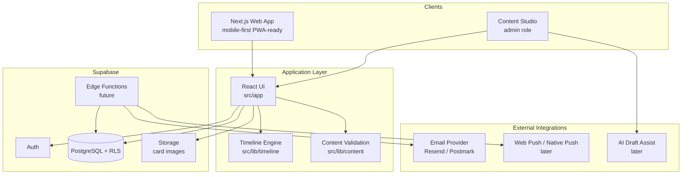
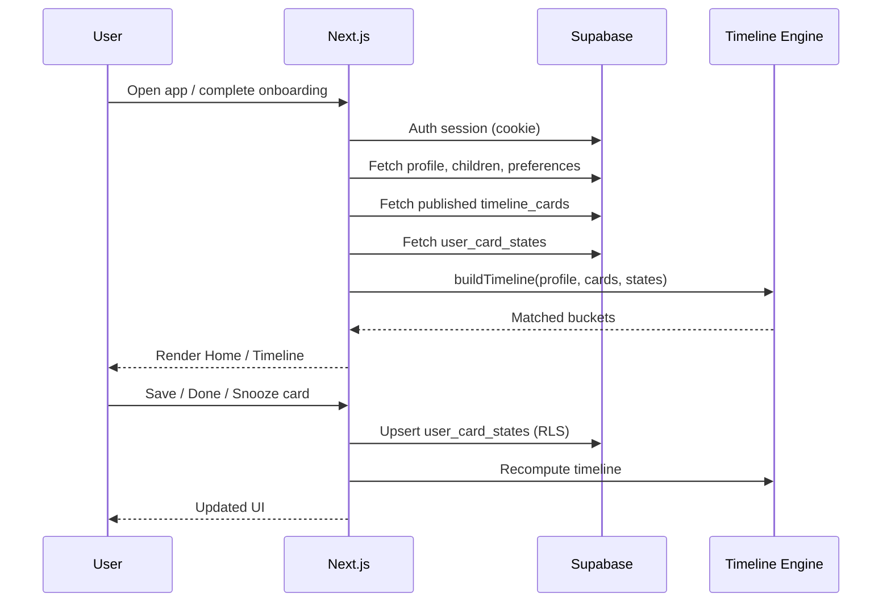
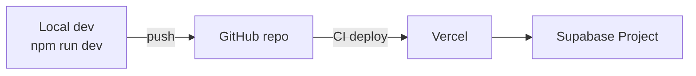

# Wish I Knew  -  Architecture

This document describes the full-stack architecture for Wish I Knew: an Australian-first, mobile-first parenting timeline app. Content is data, not code. The timeline engine is pure TypeScript and testable. Supabase is the system of record.

## System Overview



## Design Principles

1. **Content as data**  -  Cards, images, sources and lifecycle live in Supabase. The app renders data; it does not hardcode parenting advice.
2. **Timeline logic is portable**  -  Matching runs in `src/lib/timeline` with Vitest coverage. Same logic can power API routes, Edge Functions and admin debug tools.
3. **Australian-first**  -  State, language, sources and imagery default to NSW/Australia. Not a US app repackaged.
4. **Mobile-first**  -  Single-column layouts, touch targets, scrollable timeline journey, PWA-ready hosting on Vercel.
5. **Security by default**  -  Row Level Security on all user data. Admin actions gated by `profiles.role`. Published cards enforced at DB level (image required).
6. **MVP-first, not throwaway**  -  Demo mode uses localStorage today; every layer is shaped for Supabase persistence next.

## Technology Stack

| Layer | Choice | Role |
|-------|--------|------|
| Framework | Next.js 16 (App Router) | SSR, routing, API routes, deployment |
| Language | TypeScript (strict) | Shared types across UI, engine, DB |
| Styling | Tailwind CSS v4 | Design tokens, mobile layout |
| Fonts | Fraunces + Inter (`next/font`) | Display serif + body sans |
| Backend | Supabase | Auth, Postgres, Storage, RLS, Edge Functions |
| Testing | Vitest | Timeline dates, matching, publish validation |
| Hosting | Vercel (recommended) | Preview deploys, edge CDN, env vars |
| Repo | GitHub | Source control, CI (future) |

## Repository Layout

```
wish-i-knew/
├── docs/                    # Product, architecture, content rules
├── public/
│   ├── card-images/pixel/   # 8-bit card item art (MVP assets)
│   └── illustrations/       # Hero / scene art
├── src/
│   ├── app/                 # Next.js routes and main UI shell
│   ├── lib/
│   │   ├── content/         # Demo cards, publish validation
│   │   ├── supabase/        # Browser + server Supabase clients
│   │   └── timeline/        # Dates, matching engine, types
│   └── types/               # Shared content/timeline types
├── supabase/
│   ├── migrations/          # Schema, RLS, publish constraints
│   └── seed.sql             # Six sample published cards
└── tests/                   # Vitest unit tests
```

## Application Layers

### 1. Presentation (`src/app`)

- **`wish-i-knew-app.tsx`**  -  Client shell: onboarding, Home, Timeline, Saved, Settings, Content Studio preview.
- **Demo persistence**  -  `localStorage` key `wish-i-knew-demo-state` until Supabase auth is wired.
- **Views**
  - **Home**  -  Weekly Lookahead summary + current/coming-soon cards.
  - **Timeline**  -  Continuous scroll: Heads up (overdue) → This week → Coming soon → Later.
  - **Saved / Settings / Content Studio**  -  User actions and admin card-health preview.

Card images render from `timeline_cards.image_url` (today: demo array; production: Supabase row).

### 2. Timeline Engine (`src/lib/timeline`)

Pure functions. No React, no Supabase imports.

**Inputs:** child profile (birth/due date, state, flags), published cards, user card states, `comingSoonDays` window.

**Outputs:**

| Bucket | Meaning |
|--------|---------|
| `overdueCards` | Age/pregnancy window ended  -  "Heads up, you may have missed" |
| `currentCards` | Active window now  -  "On for this week" |
| `snoozedCardsDue` | Snooze expired  -  resurface |
| `comingSoonCards` | Starts within N days  -  "What's next" |
| `laterCards` | Starts after N days  -  "Down the track" |
| `savedCards` | User saved for later |

**User state filtering:** `done`, `dismissed`, `not_relevant` hidden; `snoozed` hidden until due date.

See `docs/timeline-engine.md` for matching rules and match-reason codes (for future admin debug).

### 3. Content Layer (`src/lib/content`)

- **`validation.ts`**  -  Publish rules: mandatory image, sources for sensitive cards, review dates.
- **`demo-cards.ts`**  -  Six cards mirroring `supabase/seed.sql` for offline demo.

Production path: fetch `timeline_cards` where `status = 'published'` via Supabase client.

### 4. Data Layer (Supabase)

**Core tables:** `profiles`, `children`, `timeline_cards`, `user_card_states`, `weekly_lookahead_preferences`, `reminders`, `content_import_batches`, `content_audit_log`.

**RLS:** Users read/write own children and card states. Admins manage cards via `profiles.role = 'admin'`. Published cards readable by authenticated users.

**DB constraints:** Published cards must have `image_url` and valid `image_status`. Sensitive cards require sources and review metadata.

See `docs/content-model.md` and `supabase/migrations/001_initial_schema.sql`.

## Request Flow (Target Production)



## Authentication (Planned)

- Supabase Auth: email magic link or OAuth (Google/Apple for mobile-friendly signup).
- `@supabase/ssr` cookie sessions: `src/lib/supabase/client.ts` (browser), `server.ts` (RSC/API).
- **Next step:** Auth middleware to refresh sessions; sign-up/onboarding writes `profiles` + `children` + `weekly_lookahead_preferences`.

## Image Architecture

Two-tier visual system (see `docs/card-image-guidelines.md`):

1. **Card items**  -  Cute 8-bit pixel collectibles (`public/card-images/pixel/` in MVP; Supabase Storage in production).
2. **Hero / scenes**  -  Painterly NSW coastal illustration (`public/illustrations/`).

**Production path:** Admin uploads to Supabase Storage → `image_url` on card → CDN URL. Publish validation blocks cards without approved images.

## Admin / Content Studio (Planned)

Role-gated admin UI on same Next.js app (or separate `/admin` route group):

- CRUD on `timeline_cards` with lifecycle states.
- Image upload + `image_status` workflow.
- Publish validation surfaced in UI (already previewed in demo Content tab).
- Match debugger: run engine against sample child profile.

See `docs/admin-workflow.md`.

## Deployment Architecture



**Environments:**

| Env | Next.js | Supabase | Notes |
|-----|---------|----------|-------|
| Local | `localhost:3000` | Local or dev project | `.env.local` |
| Preview | Vercel preview URL | Dev/staging project | PR previews |
| Production | `wishiknew.com.au` (TBD) | Production project | Custom domain |

**Env vars:** `NEXT_PUBLIC_SUPABASE_URL`, `NEXT_PUBLIC_SUPABASE_ANON_KEY`. Service role key only on server/Edge Functions, never exposed to client.

## Security Model

- **RLS** on all user-owned rows.
- **Admin** via `is_admin()` SQL helper + policies.
- **Published content** readable by authenticated users only (adjust for marketing site later if needed).
- **Sensitive cards** require `source_urls` and review dates at DB + validation layer.
- **No medical diagnosis**  -  content is practical guidance with Australian sources; AI assists drafting only (future).

## Current State vs Next

| Area | Now | Next |
|------|-----|------|
| Data | Demo cards + localStorage | Supabase auth + live queries |
| Images | Committed PNG assets | Storage upload + CDN |
| Notifications | Preferences captured in onboarding | Email → web push → native |
| Admin | Read-only card health preview | Full Content Studio |
| CI | Manual test/lint | GitHub Actions on PR |
| Payments | Not started | Freemium (Zuora-style entitlements later) |

See `docs/build-roadmap.md` for phased delivery.

## Related Docs

- `docs/integrations.md`  -  External services and wiring detail
- `docs/content-model.md`  -  Card lifecycle and tables
- `docs/timeline-engine.md`  -  Matching rules
- `docs/product-brief.md`  -  MVP promise and audience
- `docs/design-direction.md`  -  Visual identity
- `docs/safety-and-sources.md`  -  Sensitive content rules
