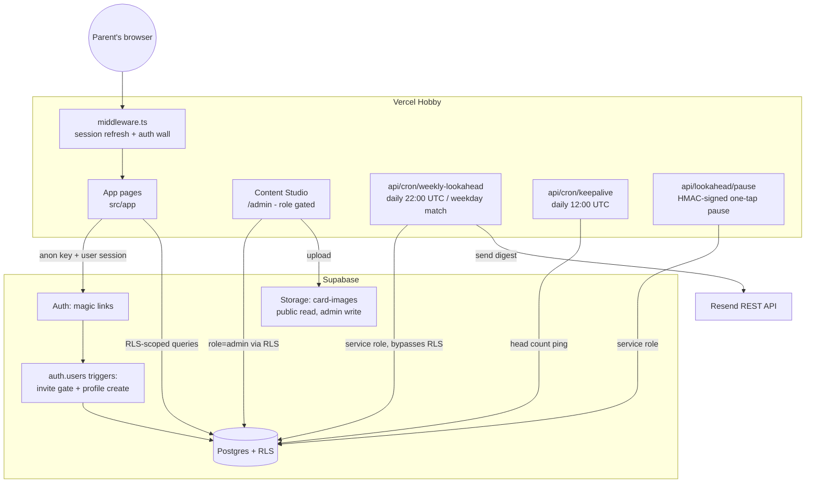
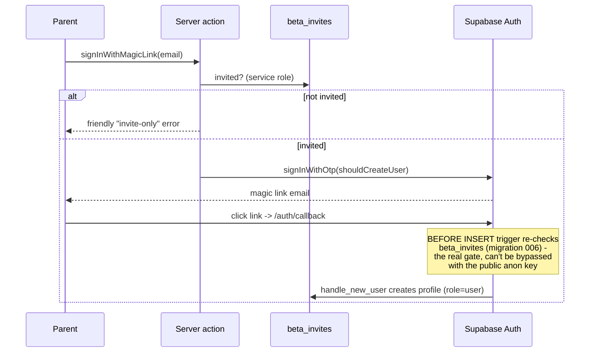
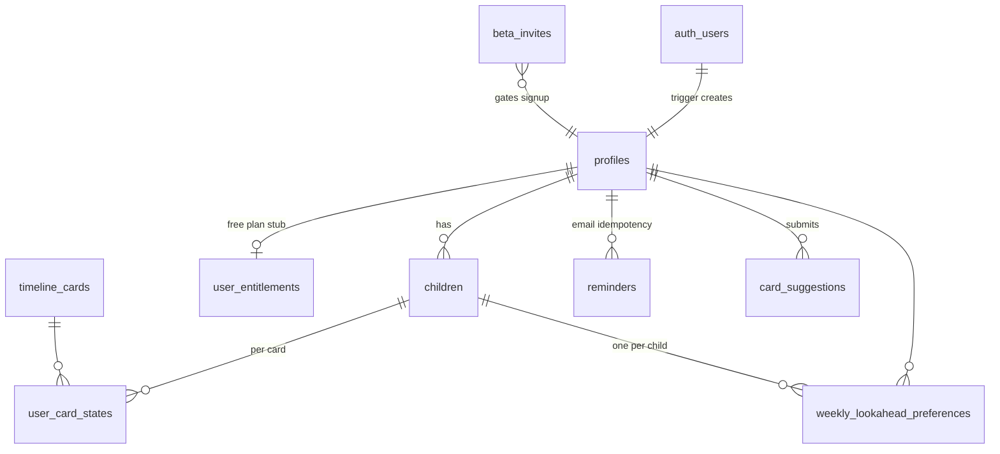
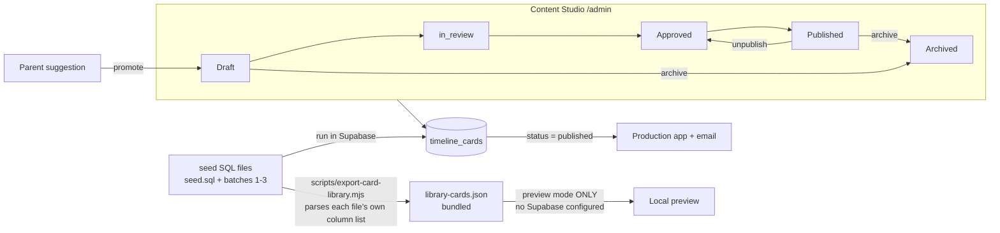
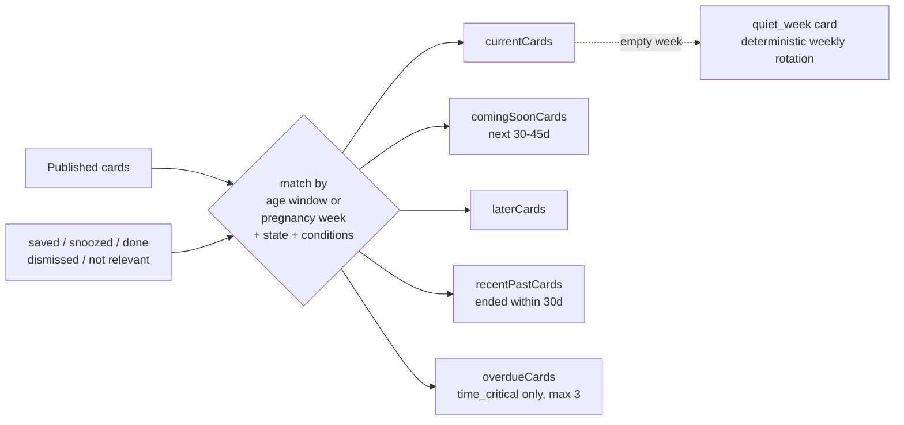
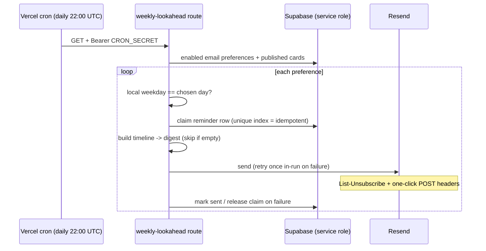

# How Wish I Knew works (as built)

The living operational doc. `architecture.md` is the original design; this file
describes what is actually running. Update it when behaviour changes.

Stack: **Next.js (App Router) on Vercel Hobby · Supabase (Auth + Postgres/RLS +
Storage) · Resend** for the weekly email. No other moving parts.

## System overview

Three trust levels, three clients:

| Client | Key | Sees |
|---|---|---|
| Browser / app pages | anon key + user session | Only what RLS allows for that user |
| Admin pages | same, but `profiles.role = 'admin'` | Everything RLS grants admins |
| Cron + pause routes | `SUPABASE_SERVICE_ROLE_KEY` | Everything (bypasses RLS) - server-only, never imported client-side |

## Auth wall and invite-only signup

- The server-action check is **UX only** (friendly error). The database trigger
  `enforce_beta_invite` is the enforcement - it fires even if someone calls
  Supabase's `/auth/v1/otp` directly with the public anon key.
- **Going public:** drop the trigger (`006_enforce_beta_invite.sql` has the
  exact statements in its header comment).
- The middleware (`src/middleware.ts` → `lib/supabase/middleware.ts`) refreshes
  the session cookie and redirects signed-out users to `/login` unless the path
  is in `PUBLIC_PATH_PREFIXES` (`lib/launch/config.ts`). **API routes are not
  public by default** - each public API path is listed explicitly and carries
  its own auth (CRON_SECRET header or signed token).

## Data model

RLS in one breath: users see and edit **their own** rows (children, card
states, preferences, reminders, suggestions) via `current_profile_id()`;
everyone reads **published** cards only; admins (`is_admin()`) manage cards and
read user data; `beta_invites` is service-role only. Both helper functions are
`security definer` with pinned `search_path`. Migration 007 additionally locks
`user_card_states.child_id` to the user's own children and blocks self-service
`profiles.email` edits (the cron reads that column to address digests).

## Card content pipeline

- **Production truth is the database.** The bundled JSON is used only when
  Supabase is not configured (local preview) or for anonymous non-auth-required
  browsing. Archiving a card in the admin removes it everywhere that matters.
- The export script reads each seed file's own INSERT column list - the files
  genuinely differ (seed.sql predates `time_critical`/`allergy_sensitivity`),
  and a hardcoded list silently corrupts every value after a missing column.
- Publish gates (enforced in UI validation **and** DB constraints): image +
  alt text required; sensitivity-flagged cards also need sources, a
  last-reviewed date and a review-due date.
- Card workflow for a new idea: suggestion arrives → *Promote to draft card* →
  fill content → *Copy prompt* → generate pixel art externally → upload (alt
  text auto-fills) → publish when checks pass.

## Timeline engine

Pure TypeScript, no I/O (`src/lib/timeline/`). Input: profile (birth/due date,
state, conditions) + published cards + per-card user state. Output buckets:

Only `time_critical` cards may nag from the past; everything else quietly drops
away. Paused/ended journeys return an empty timeline. The same engine powers
the app UI and the weekly email digest (max 4 cards, current before soon).

## Weekly email (day + hour matching)

Design decisions that matter:

- **Daily cron, weekday matching.** `vercel.json` schedules `/api/cron/weekly-lookahead`
  once per day at `0 22 * * *` UTC (~8am Australia/Sydney). The route matches the
  user's chosen *weekday* in their *timezone*; preferred clock time is stored but
  not used for send gating.
- The `reminders` unique index `(user, child, type, date)` makes sends
  idempotent; a failed send releases the claim so a manual re-run the same local
  day can retry.
- The pause link is HMAC-signed (`WIK_EMAIL_TOKEN_SECRET`, falls back to
  `CRON_SECRET`). GET shows a confirm page (mail scanners prefetch GETs);
  POST pauses - and doubles as the RFC 8058 one-click unsubscribe endpoint.
- `keepalive` pings the DB daily so free-tier Supabase doesn't pause.

## Environment variables

| Variable | Where | Purpose |
|---|---|---|
| `NEXT_PUBLIC_SUPABASE_URL` / `NEXT_PUBLIC_SUPABASE_ANON_KEY` | client + server | Supabase connection (anon key is public by design; RLS is the security) |
| `NEXT_PUBLIC_SITE_URL` | server | Absolute links in emails + auth redirects |
| `WIK_REQUIRE_AUTH` | server | Auth wall; defaults **on** in production |
| `WIK_BETA_INVITE_ONLY` | server | Friendly invite check in the sign-in action |
| `SUPABASE_SERVICE_ROLE_KEY` | server only | Cron + pause + invite check; bypasses RLS |
| `CRON_SECRET` | server only | Bearer auth for cron routes |
| `WIK_EMAIL_TOKEN_SECRET` | server only | Signs pause links (optional; falls back to CRON_SECRET) |
| `RESEND_API_KEY` / `WIK_FROM_EMAIL` | server only | Weekly email |

## Runbook

- **New admin:** `update public.profiles set role='admin' where email='...';`
- **Invite someone:** `insert into public.beta_invites (email) values ('lower@case');`
- **Test the cron locally:** `curl -H "Authorization: Bearer $CRON_SECRET" localhost:3000/api/cron/weekly-lookahead`
- **Card won't publish:** the readiness panel lists why; sensitive cards need sources + review dates + image.
- **Rotate CRON_SECRET safely:** set `WIK_EMAIL_TOKEN_SECRET` first (old pause links die otherwise).
- **Going public:** drop the invite trigger (see 006), revisit the privacy
  policy (deletion contact, overseas disclosure), add real unsubscribe copy,
  and turn `WIK_BETA_INVITE_ONLY` off.
