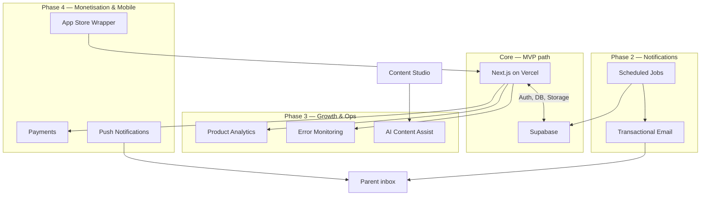
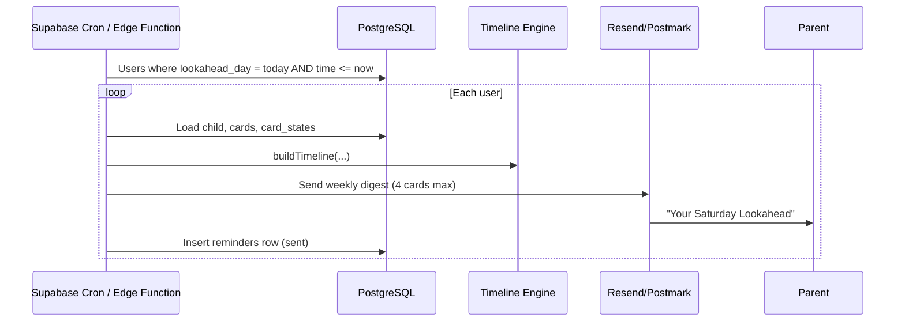

# Wish I Knew — Integrations

How Wish I Knew connects to external services. MVP uses Supabase only; other integrations are phased in without rewriting core architecture.

## Integration Map



## 1. Supabase (Core)

**Status:** Schema + clients ready; app running in demo mode until project is linked.

| Capability | Use in Wish I Knew |
|------------|-------------------|
| **Auth** | Parent accounts; magic link / OAuth |
| **PostgreSQL** | All content and user state |
| **RLS** | Per-user data isolation; admin role |
| **Storage** | Card images, thumbnails, hero assets |
| **Edge Functions** | Weekly Lookahead send, webhooks, batch jobs |
| **Realtime** | Optional later for live admin collaboration |

### Setup

1. Create project at [supabase.com](https://supabase.com).
2. Run migration: `supabase/migrations/001_initial_schema.sql`.
3. Seed: `supabase/seed.sql`.
4. Copy project URL + anon key to `.env.local` (from `.env.example`).

```bash
NEXT_PUBLIC_SUPABASE_URL=https://xxxx.supabase.co
NEXT_PUBLIC_SUPABASE_ANON_KEY=eyJ...
```

### Client wiring

| File | Runtime | Purpose |
|------|---------|---------|
| `src/lib/supabase/client.ts` | Browser | Client components, auth UI |
| `src/lib/supabase/server.ts` | Server | RSC, Route Handlers, cookie session |

**Still to build:**

- Auth middleware (session refresh)
- Server actions / API routes for card state upserts
- Storage bucket `card-images` with public read, admin write
- Trigger: on `auth.users` insert → create `profiles` row

### Storage layout (planned)

```
card-images/
  published/{slug}/main.png
  published/{slug}/thumb.png
  drafts/{card_id}/...
illustrations/
  hero-coastal.png
```

## 2. Vercel (Hosting)

**Status:** Recommended; not yet linked to repo.

| Feature | Use |
|---------|-----|
| Git deploy | Auto deploy on push to `main` |
| Preview URLs | PR review |
| Env vars | Supabase keys per environment |
| Edge | Fast AU delivery (Sydney region when available) |

**Setup:** Import GitHub repo → set env vars → deploy. `allowedDevOrigins` in `next.config.ts` includes `127.0.0.1` for local Glass browser testing.

## 3. Email (Weekly Lookahead)

**Status:** Planned — highest priority notification channel (works on every phone, no app install).

**Recommended providers:** [Resend](https://resend.com) or [Postmark](https://postmarkapp.com) (transactional, good deliverability, simple API).

### Flow



### Data already in schema

- `weekly_lookahead_preferences` — day, time, timezone, channel
- `reminders` — delivery log, status enum
- `delivery_channel` enum — `in_app`, `email`, `push_later`, `manual_only`

### Email content principles

- One calm weekly email, not a drip campaign.
- Link deep-links to app `/` with card slug hash.
- Unsubscribe / pause without deleting account.
- No guilt language; matches product tone.

**Env vars (future):**

```bash
RESEND_API_KEY=re_...
WIK_FROM_EMAIL=lookahead@wishiknew.com.au
```

## 4. Web Push (PWA)

**Status:** Later — after email proves the ritual.

- Service worker via Next.js PWA plugin or custom SW.
- VAPID keys; store push subscriptions on `profiles` or new table.
- Same cron job as email, channel = `push_later` or user preference.

Good for installed-home-screen mobile users in AU.

## 5. Native Push (iOS / Android)

**Status:** Later — requires Capacitor, Expo, or React Native wrapper around web app.

- Use native push (APNs / FCM) for reliable mobile nudges.
- Same preference model; user picks email vs push vs both.

## 6. Product Analytics (Optional)

**Status:** Not started. Add when real users exist.

| Option | Notes |
|--------|-------|
| PostHog | Self-hostable, funnels, feature flags |
| Plausible / Fathom | Privacy-friendly page analytics |
| Vercel Analytics | Basic web vitals |

Track: onboarding completion, Lookahead open rate, card save/done/snooze, not pageviews for vanity.

## 7. Error Monitoring (Optional)

**Status:** Not started.

- **Sentry** — Next.js SDK, source maps on Vercel.
- Capture timeline engine errors separately from UI errors.

## 8. AI Content Assist (Future)

**Status:** Not in MVP. Assists admins only — never diagnoses or replaces sources.

| Use | Do not use |
|-----|------------|
| Draft card copy from bullet notes | Medical advice without sources |
| Summarise long source pages | Auto-publish without human review |
| Generate `illustration_prompt` | Copy competitor / American content |

**Suggested:** OpenAI or Anthropic API from Supabase Edge Function or admin-only API route. All AI output saved as `draft`, never `published` without review.

## 9. Payments / Freemium (Future)

**Status:** Deferred. No banner ads.

Aligned with your Zuora background — entitlement-based freemium:

- **Free:** Core timeline, limited lookahead history, basic cards.
- **Paid:** Full timeline depth, partner mode, premium packs, earlier lookahead.

**Candidates:** Stripe Billing + Supabase custom claims, or Zuora if subscription complexity grows.

Not needed until content library and retention are proven.

## 10. Domain & DNS (Future)

- Primary: `wishiknew.com.au` or similar `.com.au`
- Vercel custom domain + SSL
- Email SPF/DKIM for Lookahead sender domain

## Environment Variable Reference

| Variable | Required | Where | Purpose |
|----------|----------|-------|---------|
| `NEXT_PUBLIC_SUPABASE_URL` | Yes (prod) | Client + server | Supabase project URL |
| `NEXT_PUBLIC_SUPABASE_ANON_KEY` | Yes (prod) | Client + server | Public anon key (RLS protected) |
| `SUPABASE_SERVICE_ROLE_KEY` | Server only | Edge Functions / admin scripts | Bypass RLS — never expose to browser |
| `RESEND_API_KEY` | Later | Edge Function | Send email |
| `WIK_FROM_EMAIL` | Later | Edge Function | From address |
| `OPENAI_API_KEY` | Later | Admin API | Draft assist |
| `SENTRY_DSN` | Optional | Next.js | Error tracking |

## Integration Build Order

1. **Supabase** — auth, live cards, user state persistence
2. **Vercel** — deploy from GitHub, staging env
3. **Storage** — move card images off repo into bucket
4. **Email** — Weekly Lookahead cron + Resend
5. **Web push** — PWA install path
6. **Analytics + Sentry** — when beta users exist
7. **AI assist** — admin drafting only
8. **Payments** — when freemium is defined

See `docs/build-roadmap.md` for product phasing alignment.
